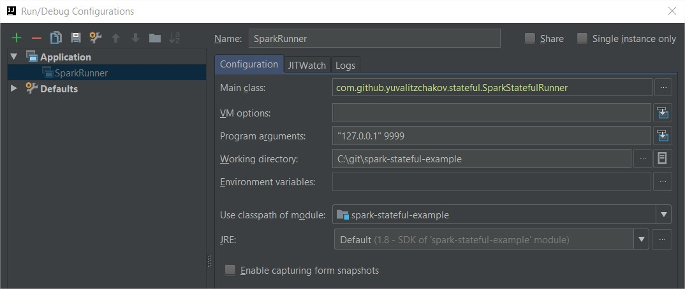

This repository is a complementary to the my blog post regarding [stateful streaming in Spark](http://asyncified.io/2016/07/31/exploring-stateful-streaming-with-apache-spark/).
It contains a working example which uses the same data structures discussed in the post.

This example assumes you already have Spark set up locally or remotely.

Steps to make this code run:

1. Clone the code
2. Set a checkpoint directory inside the application.conf file under the "checkpoint-directory" key:

  ```
  spark {
    spark-master-url = "local[*]"
    checkpoint-directory = "" 
    timeout-in-minutes = 5
  }
  ```

3. This application uses a socket stream to consume data (this was the simplest way to make this work). In order for that to work, you need to pass two arguments to the program:

    a. The host
    b. The port
    
 For anyone using IntelliJ, you can configure the "Program Arguments" in the configuration:

  

  Otherwise you can pass it as arguments to `spark-submit` or pass them locally via your favorite IDE.

4. Start up [netcat](http://nc110.sourceforge.net/) on the same port you pass the program.
5. Take the data from resources/sample-data.txt and send them via netcat. 
6. Set breakpoints as you desire and watch the app run!
